<picture>
  <source media="(prefers-color-scheme: dark) and (max-width: 600px)" srcset="assets/field-hero-mobile-dark.svg" />
  <source media="(prefers-color-scheme: dark)" srcset="assets/field-hero-dark.svg" />
  <source media="(max-width: 600px)" srcset="assets/field-hero-mobile-light.svg" />
  
</picture>

<picture>
  <source media="(prefers-color-scheme: dark) and (max-width: 600px)" srcset="assets/field-connections-mobile-dark.svg" />
  <source media="(prefers-color-scheme: dark)" srcset="assets/field-connections-dark.svg" />
  <source media="(max-width: 600px)" srcset="assets/field-connections-mobile-light.svg" />
  
</picture>

### The whole system is the work.

I want to understand what happens all the way from a training example to a person getting something done. That takes me from **datasets and small models** into **MLX and Metal**, then back up through **retrieval, agents, and the interfaces people actually touch**.

Follow a connection: [the data](https://huggingface.co/datasets/philipjohnbasile/glm52-demolition-data) → [the model](https://huggingface.co/philipjohnbasile/wisp-coder-110m) → [the runtime](#the-patches) → [the agent](#the-lab) → [the person](#the-person).

Those links cross different projects. Together, they show the direction of the work.

  <a href="#the-patches">The code</a> &nbsp; / &nbsp;
  <a href="#models-and-data">The models</a> &nbsp; / &nbsp;
  <a href="#the-lab">The systems</a> &nbsp; / &nbsp;
  <a href="#the-person">The person</a> &nbsp; / &nbsp;
  <a href="#field-notes">The notes</a>

**I’m Philip John Basile.** Principal AI systems engineer at **Basilcom Inc.**, open-source contributor, and a maker since **1998**. I’ve built campaign experiences, commerce, telehealth, enterprise search, and mission-planning systems. Today I build models, contribute to Apple’s MLX, and work on the runtimes and agents that make local AI useful.

I care about how a system feels to use, what happens when it fails, and whether someone else can understand what I built.

[The wider portfolio ↗](https://philipjohnbasile.com/) · [Hugging Face ↗](https://huggingface.co/philipjohnbasile) · [Say hello ↓](#say-hello)

<h3><picture>
  <source media="(prefers-color-scheme: dark) and (max-width: 600px)" srcset="assets/field-upstream-mobile-dark.svg" />
  <source media="(prefers-color-scheme: dark)" srcset="assets/field-upstream-dark.svg" />
  <source media="(max-width: 600px)" srcset="assets/field-upstream-mobile-light.svg" />
  
</picture></h3>

I contribute to the tools I use. Three merged fixes in **Apple’s MLX and MLX-LM**:

**[MLX #3922 — beyond 32K rows ↗](https://github.com/ml-explore/mlx/pull/3922)** 
Correct row-count overflow in sorted quantized matrix multiplication.

**[MLX #4202 — the small-group boundary ↗](https://github.com/ml-explore/mlx/pull/4202)** 
Correct scale and bias indexing for small quantization groups.

**[MLX-LM #1623 — keep converted weights correct ↗](https://github.com/ml-explore/mlx-lm/pull/1623)** 
Prevent a second normalization shift when converting Qwen weights.

[All upstream work ↗](https://philipjohnbasile.com/open-source)

<strong>Follow the upstream work — Unsloth, MTPLX, oMLX, and more</strong>

| Project | What I've been working on | Status |
|---|---|---|
| [**Apple MLX**](https://github.com/ml-explore/mlx) | Fixed issues in quantized matrix multiplication involving [row overflow](https://github.com/ml-explore/mlx/pull/3922) and [small quantization groups](https://github.com/ml-explore/mlx/pull/4202). | Merged |
| [**Apple MLX-LM**](https://github.com/ml-explore/mlx-lm) | Fixed a [Qwen model conversion bug](https://github.com/ml-explore/mlx-lm/pull/1623) that applied a normalization adjustment twice. | Merged |
| [**Unsloth Studio**](https://github.com/unslothai/unsloth) | Working on agents that [make changes in separate Git worktrees](https://github.com/unslothai/unsloth/pull/10658) and [run tests and builds with execution limits](https://github.com/unslothai/unsloth/pull/10672). | Open PRs |
| [**MTPLX**](https://github.com/youssofal/MTPLX) | Contributed [Hy3 and Qwen native MTP backends](https://github.com/youssofal/MTPLX/pull/142#issuecomment-5001984512), plus [JSON-schema output](https://github.com/youssofal/MTPLX/pull/187), [structured tool calls](https://github.com/youssofal/MTPLX/pull/188), and [recovery after daemon crashes](https://github.com/youssofal/MTPLX/pull/221). | Shipped upstream; more PRs open |
| [**oMLX**](https://github.com/jundot/omlx) | Fixed [MLX memory reclamation](https://github.com/jundot/omlx/pull/2635) and [Python version compatibility checks for bundled kernels](https://github.com/jundot/omlx/pull/3558). | Merged; more PRs open |
| [**AirRunner's MLX-LM**](https://github.com/AirRunner/mlx-lm) | Improved [MTP cache handling, token probabilities, and validation](https://github.com/AirRunner/mlx-lm/pull/2). | Merged |

I've also submitted PRs to MLX Serve, vLLM Metal, dflash, Google Ads MCP, Nixpkgs, conda-forge, MacPorts, Rust, and Bootstrap.

[See my upstream pull requests](https://github.com/search?q=is%3Apublic+is%3Apr+author%3APhilipJohnBasile+-user%3APhilipJohnBasile&type=pullrequests)

<h3><picture>
  <source media="(prefers-color-scheme: dark) and (max-width: 600px)" srcset="assets/field-models-mobile-dark.svg" />
  <source media="(prefers-color-scheme: dark)" srcset="assets/field-models-dark.svg" />
  <source media="(max-width: 600px)" srcset="assets/field-models-mobile-light.svg" />
  
</picture></h3>

My Hugging Face work connects original training, model compression, Apple Silicon conversions, and the data behind them. I publish the usable artifacts alongside the methods, runtime requirements, and limits.

**20 models · 1 dataset · 2 Spaces** · [Explore the Local AI Guide ↗](https://huggingface.co/spaces/philipjohnbasile/local-ai-guide) 
Public Hugging Face repositories, checked September 11, 2026.

### Start with something you can try.

**[Wisp Coder — mind the gap ↗](https://huggingface.co/spaces/philipjohnbasile/wisp-coder-demo)** 
A small code model I trained from step zero on Apple Silicon. Give it the code on either side of a cursor and see what it puts in the middle. The [model card](https://huggingface.co/philipjohnbasile/wisp-coder-110m) follows the whole experiment, including what didn’t work.

**[Hy3 & GLM — what can we make smaller? ↗](https://huggingface.co/philipjohnbasile/hy3-demolition-mlx-reap25-v1)** 
Expert pruning, LoRA recovery, quantization, and the tradeoffs that come with them. Smaller weights are only useful if you can see what changed in the model.

**[Qwen & Ornith — bring the weights home ↗](https://huggingface.co/philipjohnbasile/Qwen3.6-27B-Fable-Fusion-711-MTPLX-6bit)** 
MLX conversions and MTP calibration, with source provenance and the runtime recipes needed to reproduce the result.

**[Training data — follow the ingredients ↗](https://huggingface.co/datasets/philipjohnbasile/glm52-demolition-data)** 
Code, tool use, repair, adapters, and calibration data. The [data-to-model story](https://github.com/PhilipJohnBasile/engineering-case-studies/blob/main/data-to-models.md) connects the preparation tools to the published experiments.

[Models ↗](https://huggingface.co/philipjohnbasile/models) · [Full catalog ↗](DATA-AND-MODELS.md)

<strong>Go deeper — model families, calibration, provenance, and results</strong>

My [**Hugging Face**](https://huggingface.co/philipjohnbasile) work covers original models, conversions, experimental derivatives, and training data. I work on both the models themselves and the engineering needed to run them locally.

**[Explore my Local AI Guide](https://huggingface.co/spaces/philipjohnbasile/local-ai-guide).** I built a searchable catalog of the releases so you can browse by project, use case, artifact type, and download size. Each entry links to the model card, the inspected revision, and available evaluation records, with the runtime requirements explained alongside it.

### Wisp Coder: a model I built from scratch

**[Try Wisp in your browser](https://huggingface.co/spaces/philipjohnbasile/wisp-coder-demo).** Edit the code around the cursor and ask it to fill the gap. The free demo runs the standard decoder on CPU.

With [**Wisp Coder 110M**](https://huggingface.co/philipjohnbasile/wisp-coder-110m), I took the work from tokenizer training to released weights. I trained a 32K-token tokenizer on 400,000 documents and a 108.2M-parameter code model on 5 billion tokens using MLX on Apple Silicon. Fill-in-the-middle and multi-token prediction were part of training from the start.

I checked the export against Transformers, published decoding correctness checks, and evaluated five models across 1,372 code-completion tasks. I published the comparisons even when they didn't favor Wisp. The [Wisp case study](https://github.com/PhilipJohnBasile/engineering-case-studies/blob/main/wisp-model-training.md) covers the design decisions, evidence, and limitations.

### Model compression and conversions

- **[Hy3](https://huggingface.co/philipjohnbasile/hy3-demolition-mlx-reap25-v1) and [GLM-5.2](https://huggingface.co/philipjohnbasile/GLM-5.2-Demolition-q4a4-soul-MLX) compression** — Pruned mixture-of-experts models, trained LoRA adapters, and published smaller MLX builds. The Hy3 release removes 25% of experts per layer, then uses LoRA training to recover capability. The cards include evaluations, regressions, and the exact runtime recipes.
- **[Qwen Fable-Fusion for MLX and MTPLX](https://huggingface.co/philipjohnbasile/Qwen3.6-27B-Fable-Fusion-711-MTPLX-6bit)** — Reconstructed DavidAU's GGUF release for MLX, published 4-, 6-, and 8-bit builds, and calibrated the multi-token prediction head. The featured 6-bit build includes vision support through MTPLX, with conversion details and measured decoding results in the card.
- **[Ornith 1.5 for MTPLX](https://huggingface.co/philipjohnbasile/ornith-ai-Ornith-1.5-35B-A3B-V2-MTPLX)** — Converted Ornith AI's model for Apple Silicon with mixed-precision weights and a BF16 MTP head. The card documents source provenance, runtime requirements, and what has and hasn't been validated.
- **[Akka for MLX](https://huggingface.co/philipjohnbasile/Qwen3.6-27B-Akka-6bit-MLX)** — Converted nightmedia's merge to 6-bit MLX and checked its draft head against the target model. Calibration failed, so I released it without the MTP head and published the results.
- **[DeepSeek V4 Flash for MLX](https://huggingface.co/philipjohnbasile/DeepSeek-V4-Flash-0731-MLX-M5Max-TargetOnly)** — Built an experimental conversion and published comparisons against the original model, including a full 198-question GPQA Diamond run. Retained as a reference, with the quality regressions and faster alternative documented.

### Datasets and training pipelines

I published [**GLM-5.2 Demolition training and calibration data**](https://huggingface.co/datasets/philipjohnbasile/glm52-demolition-data): **154 JSONL files** covering code training, agent tool-use examples, repair, domain-specific adapters, and expert-pruning calibration.

I also built the import and verification tools around it: sampling by domain, normalizing chat and tool messages, keeping source labels, and separating training examples from calibration prompts. The [**data-to-model case study**](https://github.com/PhilipJohnBasile/engineering-case-studies/blob/main/data-to-models.md) follows the public code and records into the Hy3 model experiments.

[**Explore the datasets, training methods, and all 20 model repositories**](DATA-AND-MODELS.md)

I also group featured releases in [**Selected Work**](https://huggingface.co/collections/philipjohnbasile/start-here-selected-work-6aa309b179b2a196db52a12b) and research artifacts in [**Apple Silicon — Experimental Models**](https://huggingface.co/collections/philipjohnbasile/apple-silicon-experimental-models).

[Browse all models](https://huggingface.co/philipjohnbasile/models) · [Browse datasets](https://huggingface.co/philipjohnbasile/datasets)

<h3><picture>
  <source media="(prefers-color-scheme: dark) and (max-width: 600px)" srcset="assets/field-work-mobile-dark.svg" />
  <source media="(prefers-color-scheme: dark)" srcset="assets/field-work-dark.svg" />
  <source media="(max-width: 600px)" srcset="assets/field-work-mobile-light.svg" />
  
</picture></h3>

The model is one part. The rest is memory, tools, retrieval, failure recovery, and the moment a person needs to take over. These are the systems I’m working across. **Open a title to follow the work.**

<picture>
  <source media="(prefers-color-scheme: dark) and (max-width: 600px)" srcset="assets/field-case-wisp-mobile-dark.svg" />
  <source media="(prefers-color-scheme: dark)" srcset="assets/field-case-wisp-dark.svg" />
  <source media="(max-width: 600px)" srcset="assets/field-case-wisp-mobile-light.svg" />
  
</picture>

### From step zero to the cursor.

I trained **Wisp Coder** from tokenizer to released weights on Apple Silicon: a 32K-token tokenizer, **108.2M parameters**, and **5 billion training tokens**, with fill-in-the-middle and native multi-token prediction.

**Try this:** open the demo, edit the code around the cursor, and ask Wisp to fill the gap. The free CPU demo uses the standard decoder.

**[Try Wisp in your browser ↗](https://huggingface.co/spaces/philipjohnbasile/wisp-coder-demo)**

[Model card & weights ↗](https://huggingface.co/philipjohnbasile/wisp-coder-110m) · [Training case study ↗](https://github.com/PhilipJohnBasile/engineering-case-studies/blob/main/wisp-model-training.md) · [Portfolio story ↗](https://philipjohnbasile.com/work/wisp-coder)

*100.7M trunk parameters; 108.2M with the MTP module. The standard demo does not use that module. The release includes negative results and does not claim a production MTP speedup.*

<picture>
  <source media="(prefers-color-scheme: dark) and (max-width: 600px)" srcset="assets/field-case-agents-mobile-dark.svg" />
  <source media="(prefers-color-scheme: dark)" srcset="assets/field-case-agents-dark.svg" />
  <source media="(max-width: 600px)" srcset="assets/field-case-agents-mobile-light.svg" />
  
</picture>

### Give the model useful tools. Keep people in control.

At **Basilecom / Transmission Agency**, I own AI platform architecture for **120 staff across the UK, US, and APJ**, with **12+ production MCP integrations**. That work connects business tools, identity, retrieval, evaluation, and human approval.

My current open-source direction takes that question onto the desktop: coding agents that can work in an isolated project, run checks, and share a visible browser with the person using them. **The shared-browser work is in progress.** Recovery, inspection, and a clear handoff between person and agent are part of the work.

**Explore this:** follow how access, tool contracts, operational controls, and adoption fit together in the case study.

**[Explore the agent platform ↗](https://philipjohnbasile.com/mcp-agent-platform)**

[Engineering case study ↗](https://github.com/PhilipJohnBasile/engineering-case-studies/blob/main/enterprise-ai-platform.md) · [MCP is a governance problem ↗](https://philipjohnbasile.com/notes/mcp-is-a-governance-problem)

<picture>
  <source media="(prefers-color-scheme: dark) and (max-width: 600px)" srcset="assets/field-case-local-mobile-dark.svg" />
  <source media="(prefers-color-scheme: dark)" srcset="assets/field-case-local-dark.svg" />
  <source media="(max-width: 600px)" srcset="assets/field-case-local-mobile-light.svg" />
  
</picture>

### Closer to the hardware.

MLX conversions, native multi-token prediction in **MTPLX**, and SSD-backed expert streaming with **iliria**. The work spans runtime behavior, weights, memory, and storage.

**Explore this:** start with the architecture, then inspect source revisions, runtime recipes, and published measurement records before choosing a model.

**[Explore local inference ↗](https://philipjohnbasile.com/work/local-inference)**

[iliria source ↗](https://github.com/PhilipJohnBasile/iliria) · [Measuring inference fairly ↗](https://github.com/PhilipJohnBasile/engineering-case-studies/blob/main/local-inference-measurement.md) · [Apple Silicon AI catalog ↗](https://huggingface.co/spaces/philipjohnbasile/local-ai-guide)

<picture>
  <source media="(prefers-color-scheme: dark) and (max-width: 600px)" srcset="assets/field-case-rag-mobile-dark.svg" />
  <source media="(prefers-color-scheme: dark)" srcset="assets/field-case-rag-dark.svg" />
  <source media="(max-width: 600px)" srcset="assets/field-case-rag-mobile-light.svg" />
  
</picture>

### Make retrieval earn its place in production.

RAG systems with evaluation across **retrieval, answer grounding, latency, cost, and regression behavior**. The useful part is the release process around the answer.

**Explore this:** follow the retrieval and evaluation loop, including the checks used to catch regressions before release.

**[Explore the RAG system ↗](https://philipjohnbasile.com/rag-eval-harness)**

[Learn by building the loop ↗](https://philipjohnbasile.com/agent-engineering-beginner-deep-dive) · [More engineering case studies ↗](https://github.com/PhilipJohnBasile/engineering-case-studies)

<strong>More things I build — iliria, racecontrol, CallSieve, VecStore, and PhilJS</strong>

- [**iliria**](https://github.com/PhilipJohnBasile/iliria): C/Metal inference that streams large MoE models from SSD, built on colibri. I also published the [GLM-5.2 int4 container](https://huggingface.co/philipjohnbasile/GLM-5.2-colibri-int4-with-int8-mtp) it serves.
- [**racecontrol**](https://github.com/PhilipJohnBasile/racecontrol): routing and failure recovery across local inference engines, with a runnable HTTP demo.
- [**CallSieve**](https://github.com/PhilipJohnBasile/callsieve): local code retrieval for coding agents, with CLI and MCP interfaces.
- [**VecStore**](https://github.com/PhilipJohnBasile/vecstore): embedded vector search with metadata filtering and persistence.
- [**PhilJS**](https://github.com/PhilipJohnBasile/philjs): an experimental TypeScript UI framework with a dependency-free signals demo.

[More projects, model experiments, and creative work](PROJECTS.md)

<strong>Read the evidence — five engineering case studies</strong>

Browse the [engineering case studies](https://github.com/PhilipJohnBasile/engineering-case-studies).

Five examples of the work behind the project list:

- [**Fixing a Metal quantization bug in Apple MLX**](https://github.com/PhilipJohnBasile/engineering-case-studies/blob/main/mlx-quantized-matmul.md): the boundary case, root cause, final upstream change, and regression tests.
- [**Training and releasing Wisp Coder**](https://github.com/PhilipJohnBasile/engineering-case-studies/blob/main/wisp-model-training.md): tokenizer training, model pretraining, runtime compatibility, and controlled experiments.
- [**Taking training data into model releases**](https://github.com/PhilipJohnBasile/engineering-case-studies/blob/main/data-to-models.md): data imports with source records, verification tools, expert-pruning calibration, and measured model tradeoffs.
- [**Measuring local inference fairly**](https://github.com/PhilipJohnBasile/engineering-case-studies/blob/main/local-inference-measurement.md): matching outputs and workloads, separating streaming behavior from speed, and reporting the actual margin.
- [**Connecting enterprise systems to AI agents**](https://github.com/PhilipJohnBasile/engineering-case-studies/blob/main/enterprise-ai-platform.md): integrations, identity, operational controls, and adoption across a global agency.

[All projects ↗](https://philipjohnbasile.com/work) · [↑ Back to the beginning](#top)

<h3><picture>
  <source media="(prefers-color-scheme: dark) and (max-width: 600px)" srcset="assets/field-about-mobile-dark.svg" />
  <source media="(prefers-color-scheme: dark)" srcset="assets/field-about-dark.svg" />
  <source media="(max-width: 600px)" srcset="assets/field-about-mobile-light.svg" />
  
</picture></h3>

I was building university websites at **Fordham in 1998**, while studying computer science. I’ve stayed close to the code ever since. The work has changed; the pull toward making something useful and interesting has stayed.

The creative work taught me to care about the audience. Healthcare and enterprise taught me what reliability costs. Today’s AI work draws on both.

<strong>01 · The creative years — 360i, campaigns, and commerce</strong>

At **360i / Dentsu**, I worked on campaign experiences including **Oreo Daily Twist**, the Super Bowl blackout response, **Oscar Mayer Bacon Barter**, and **Coca-Cola Polar Bowl**. Later, as the first technical hire at **BaubleBar**, I worked on the commerce platform and launch experiences.

That is where the appetite for motion, timing, and participation comes from. An interface can have personality and still do its job.

<strong>02 · Systems people depend on — healthcare, logistics, and defense</strong>

**Teladoc** through its NYSE debut. Clinical systems and machine learning at **IntegraMed**. Through consulting engagements: **IBM enterprise search**, **Atlas Air flight scheduling**, **Dragos cybersecurity**, and **U.S. Air Force mission planning**.

Different environments, familiar responsibilities: sensitive data, availability, performance, and changes that need a dependable path into production.

<strong>03 · The current chapter — enterprise AI and an open local stack</strong>

At **Basilecom / Transmission Agency**, I own AI platform architecture across the UK, US, and APJ: MCP integrations, private-data retrieval, evaluation, identity, and human approval. A recent Snowflake permissions and governance cleanup reduced credit consumption by **35%**, about **£2,800 a month**.

Alongside that work, I train and publish models, contribute upstream runtime fixes, and develop local agent workflows. The current shared-browser direction is simple: **one visible workspace that a person and an agent can use together**. That work is still being built and qualified.

I’ve led teams of **4–20**, coached **five engineers into senior roles**, and stayed involved in implementation. Architecture matters most when it helps a team ship.

[Career background and case studies](https://philipjohnbasile.com) · [Enterprise AI case study](https://github.com/PhilipJohnBasile/engineering-case-studies/blob/main/enterprise-ai-platform.md)

<strong>04 · Beyond the editor — community, a camera, and the rink</strong>

I’m based in **New Rochelle**. Outside software, I’ve volunteered with the **Civil Air Patrol**, photographed staff portraits pro bono for **Pelham Children’s Center**, and spent years involved in **youth hockey**.

There are plenty of worthwhile things to make that never become a repository.

[The full career ↗](https://philipjohnbasile.com/career) · [More about me ↗](https://philipjohnbasile.com/about)

<h3><picture>
  <source media="(prefers-color-scheme: dark) and (max-width: 600px)" srcset="assets/field-writing-mobile-dark.svg" />
  <source media="(prefers-color-scheme: dark)" srcset="assets/field-writing-dark.svg" />
  <source media="(max-width: 600px)" srcset="assets/field-writing-mobile-light.svg" />
  
</picture></h3>

- **[MCP is a governance problem ↗](https://philipjohnbasile.com/notes/mcp-is-a-governance-problem)** What changes when a model can act on a company’s tools and data.
- **[Learn by building the loop ↗](https://philipjohnbasile.com/agent-engineering-beginner-deep-dive)** Eight practical missions covering agents, prompting, retrieval, evaluation, and tool use.
- **[What the Wisp experiments showed ↗](https://huggingface.co/philipjohnbasile/wisp-coder-110m/blob/5919d57a7672623d8afc066032794359350e2ed2/fim-competitive-v1/FIM_RESULTS.md)** Methods, comparisons, null results, and the limits of a small code model.

<strong>A note in the margin — what didn’t work</strong>

A useful research record includes the misses. Wisp’s published comparisons include results that favored other models. The [Akka conversion](https://huggingface.co/philipjohnbasile/Qwen3.6-27B-Akka-6bit-MLX) shipped without its MTP head after calibration failed. The [experimental DeepSeek conversion](https://huggingface.co/philipjohnbasile/DeepSeek-V4-Flash-0731-MLX-M5Max-TargetOnly) documents quality regressions and a faster alternative.

That’s part of leaving a trail someone else can actually use.

[More writing ↗](https://philipjohnbasile.com/writing) · [Medium ↗](https://philipjohnbasile.medium.com/) · [↑ Back to the beginning](#top)

<a href="https://philipjohnbasile.com/contact"><picture>
  <source media="(prefers-color-scheme: dark) and (max-width: 600px)" srcset="assets/field-contact-mobile-dark.svg" />
  <source media="(prefers-color-scheme: dark)" srcset="assets/field-contact-dark.svg" />
  <source media="(max-width: 600px)" srcset="assets/field-contact-mobile-light.svg" />
  
</picture></a>

I'm interested in principal and staff engineering roles where I can own the architecture, stay close to the code, and help a team ship useful AI systems. If that sounds like your team—or you've tried one of these projects—I'd like to hear from you.

[Email](mailto:PBasile@Basilecom.com) · [Portfolio](https://philipjohnbasile.com) · [Hugging Face](https://huggingface.co/philipjohnbasile) · [Writing](https://philipjohnbasile.com/writing) · [More links](https://linktr.ee/philipjohnbasile) · [Support my open-source work](https://github.com/sponsors/PhilipJohnBasile)
