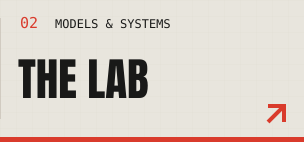
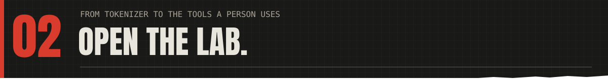
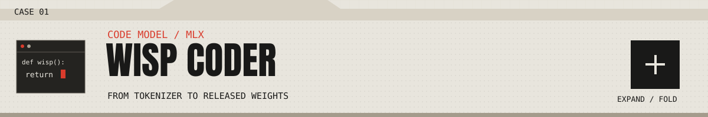
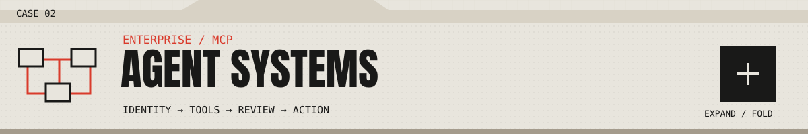
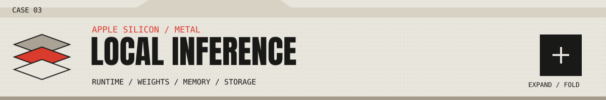
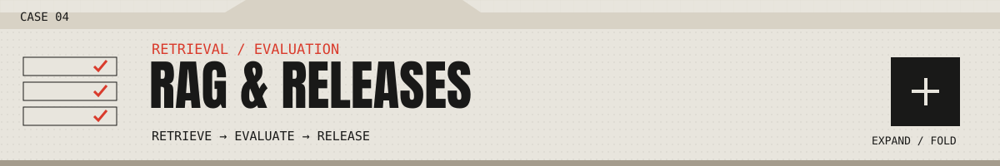
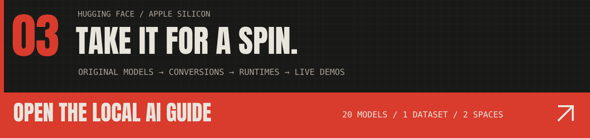
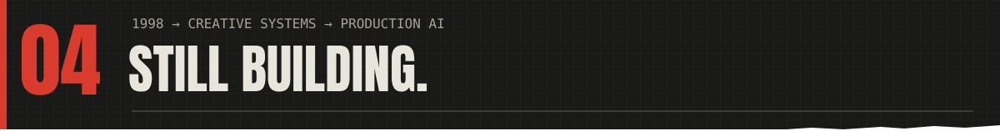

<a href="#the-lab"><picture><source media="(max-width: 600px)" srcset="assets/studio-hero-mobile.svg" /></picture></a> 
<a href="#the-patches"><picture><source media="(max-width: 600px)" srcset="assets/studio-index-patches-mobile.svg" /></picture></a><a href="#the-lab"><picture><source media="(max-width: 600px)" srcset="assets/studio-index-lab-mobile.svg" /></picture></a><a href="#field-notes"><picture><source media="(max-width: 600px)" srcset="assets/studio-index-notes-mobile.svg" /></picture></a><a href="#say-hello"><picture><source media="(max-width: 600px)" srcset="assets/studio-index-hello-mobile.svg" /></picture></a>

Pick a door. Open a project. Follow the thread.

**I’m Philip John Basile.** Principal AI systems engineer at **Basilcom Inc.**, open-source contributor, and a maker **since 1998**. I’ve worked on creative campaigns, commerce, telehealth, enterprise search, and mission planning. Today I build AI systems teams can rely on, from enterprise agents to small code models and the runtimes behind local inference on Apple Silicon.

[Explore the full portfolio ↗](https://philipjohnbasile.com/) · [Try a live model ↗](https://huggingface.co/spaces/philipjohnbasile/wisp-coder-demo) · [Browse my models & data ↗](https://huggingface.co/philipjohnbasile)

<h3><picture><source media="(max-width: 600px)" srcset="assets/connected-upstream-mobile.svg" /></picture></h3>

I contribute to the tools I use. Start with three merged fixes in **Apple’s MLX and MLX-LM**:

| Merged patch | What changed |
| --- | --- |
| **[MLX #3922 ↗](https://github.com/ml-explore/mlx/pull/3922)** | Correct results beyond 32K rows in sorted quantized matrix multiplication. |
| **[MLX #4202 ↗](https://github.com/ml-explore/mlx/pull/4202)** | Correct scale and bias indexing for small quantization groups. |
| **[MLX-LM #1623 ↗](https://github.com/ml-explore/mlx-lm/pull/1623)** | Prevent a second normalization shift when converting Qwen weights. |

[All upstream work ↗](https://philipjohnbasile.com/open-source)

<strong>Pull out the full patch drawer — Unsloth, MTPLX, oMLX, and more</strong>

I contribute to the tools I use. That includes merged fixes in **Apple's MLX and MLX-LM**, along with ongoing work on **Unsloth Studio**, **MTPLX**, and **oMLX**.

| Project | What I've been working on | Status |
|---|---|---|
| [**Apple MLX**](https://github.com/ml-explore/mlx) | Fixed issues in quantized matrix multiplication involving [row overflow](https://github.com/ml-explore/mlx/pull/3922) and [small quantization groups](https://github.com/ml-explore/mlx/pull/4202). | Merged |
| [**Apple MLX-LM**](https://github.com/ml-explore/mlx-lm) | Fixed a [Qwen model conversion bug](https://github.com/ml-explore/mlx-lm/pull/1623) that applied a normalization adjustment twice. | Merged |
| [**Unsloth Studio**](https://github.com/unslothai/unsloth) | Working on agents that [make changes in separate Git worktrees](https://github.com/unslothai/unsloth/pull/10658) and [run tests and builds with execution limits](https://github.com/unslothai/unsloth/pull/10672). | Open PRs |
| [**MTPLX**](https://github.com/youssofal/MTPLX) | Contributed [Hy3 and Qwen native MTP backends](https://github.com/youssofal/MTPLX/pull/142#issuecomment-5001984512), plus [JSON-schema output](https://github.com/youssofal/MTPLX/pull/187), [structured tool calls](https://github.com/youssofal/MTPLX/pull/188), and [recovery after daemon crashes](https://github.com/youssofal/MTPLX/pull/221). | Shipped upstream; more PRs open |
| [**oMLX**](https://github.com/jundot/omlx) | Fixed [MLX memory reclamation](https://github.com/jundot/omlx/pull/2635) and [Python version compatibility checks for bundled kernels](https://github.com/jundot/omlx/pull/3558). | Merged; more PRs open |
| [**AirRunner's MLX-LM**](https://github.com/AirRunner/mlx-lm) | Improved [MTP cache handling, token probabilities, and validation](https://github.com/AirRunner/mlx-lm/pull/2). | Merged |

I've also submitted PRs to MLX Serve, vLLM Metal, dflash, Google Ads MCP, Nixpkgs, conda-forge, MacPorts, Rust, and Bootstrap.

[See my upstream pull requests](https://github.com/search?q=is%3Apublic+is%3Apr+author%3APhilipJohnBasile+-user%3APhilipJohnBasile&type=pullrequests)

<h3><picture><source media="(max-width: 600px)" srcset="assets/connected-work-mobile.svg" /></picture></h3>

The patches lead into the work itself: **training a model, making it run, and giving it useful tools**. Open a cover to explore the project, then launch the demo or follow the evidence. Keyboard: focus a cover and press <kbd>Enter</kbd>.

<picture><source media="(max-width: 600px)" srcset="assets/case-wisp-mobile.svg" /></picture>

### A small model. The whole training story.

I trained **Wisp Coder** from tokenizer to released weights on Apple Silicon: a 32K-token tokenizer, **108.2M parameters**, and **5 billion training tokens**, with fill-in-the-middle and native multi-token prediction. The trunk has **100.7M parameters**; **108.2M** includes the MTP module.

**Try this:** open the demo, edit the code around the cursor, and ask Wisp to fill the gap. The free CPU demo uses the standard decoder.

<a href="https://huggingface.co/spaces/philipjohnbasile/wisp-coder-demo"><picture><source media="(max-width: 600px)" srcset="assets/launch-wisp-mobile.svg" /></picture></a>

[Model card & weights ↗](https://huggingface.co/philipjohnbasile/wisp-coder-110m) · [Training case study ↗](https://github.com/PhilipJohnBasile/engineering-case-studies/blob/main/wisp-model-training.md) · [Portfolio story ↗](https://philipjohnbasile.com/work/wisp-coder)

*The record includes comparisons that didn’t favor Wisp. The packaged MTP runtime checks correctness; the release does not claim a production MTP speedup.*

<picture><source media="(max-width: 600px)" srcset="assets/case-agents-mobile.svg" /></picture>

### Connect the tools. Keep the boundaries.

MCP integrations, reusable skills, identity, and approval workflows for the systems a business already uses. At **Basilecom / Transmission Agency**, my platform work supports **120 staff across the UK, US, and APJ**, with **12+ production MCP integrations**.

The current open-source direction brings that work onto the desktop: isolated coding workspaces, bounded execution, and **one visible browser a person and an agent can use together**. The shared-browser work is **in progress**, with recovery and human takeover part of what is being built and qualified.

**Explore this:** follow how access, tool contracts, operational controls, and adoption fit together in the case study.

<a href="https://philipjohnbasile.com/mcp-agent-platform"><picture><source media="(max-width: 600px)" srcset="assets/launch-agents-mobile.svg" /></picture></a>

[Engineering case study ↗](https://github.com/PhilipJohnBasile/engineering-case-studies/blob/main/enterprise-ai-platform.md) · [MCP is a governance problem ↗](https://philipjohnbasile.com/notes/mcp-is-a-governance-problem)

<picture><source media="(max-width: 600px)" srcset="assets/case-local-mobile.svg" /></picture>

### Closer to the hardware.

MLX conversions, native multi-token prediction in **MTPLX**, and SSD-backed expert streaming with **iliria**. The work spans runtime behavior, weights, memory, and storage.

**Explore this:** start with the architecture, then inspect source revisions, runtime recipes, and published measurement records before choosing a model.

<a href="https://philipjohnbasile.com/work/local-inference"><picture><source media="(max-width: 600px)" srcset="assets/launch-local-mobile.svg" /></picture></a>

[iliria source ↗](https://github.com/PhilipJohnBasile/iliria) · [Measuring inference fairly ↗](https://github.com/PhilipJohnBasile/engineering-case-studies/blob/main/local-inference-measurement.md) · [Apple Silicon AI catalog ↗](https://huggingface.co/spaces/philipjohnbasile/local-ai-guide)

<picture><source media="(max-width: 600px)" srcset="assets/case-rag-mobile.svg" /></picture>

### Make retrieval earn its place in production.

RAG systems with evaluation across **retrieval, answer grounding, latency, cost, and regression behavior**. The useful part is the release process around the answer.

**Explore this:** follow the retrieval and evaluation loop, including the checks used to catch regressions before release.

<a href="https://philipjohnbasile.com/rag-eval-harness"><picture><source media="(max-width: 600px)" srcset="assets/launch-rag-mobile.svg" /></picture></a>

[Learn by building the loop ↗](https://philipjohnbasile.com/agent-engineering-beginner-deep-dive) · [More engineering case studies ↗](https://github.com/PhilipJohnBasile/engineering-case-studies)

<strong>Open the toolbox — iliria, racecontrol, CallSieve, VecStore, and PhilJS</strong>

- [**iliria**](https://github.com/PhilipJohnBasile/iliria): C/Metal inference that streams large MoE models from SSD, built on colibri. I also published the [GLM-5.2 int4 container](https://huggingface.co/philipjohnbasile/GLM-5.2-colibri-int4-with-int8-mtp) it serves.
- [**racecontrol**](https://github.com/PhilipJohnBasile/racecontrol): routing and failure recovery across local inference engines, with a runnable HTTP demo.
- [**CallSieve**](https://github.com/PhilipJohnBasile/callsieve): local code retrieval for coding agents, with CLI and MCP interfaces.
- [**VecStore**](https://github.com/PhilipJohnBasile/vecstore): embedded vector search with metadata filtering and persistence.
- [**PhilJS**](https://github.com/PhilipJohnBasile/philjs): an experimental TypeScript UI framework with a dependency-free signals demo.

[More projects, model experiments, and creative work](PROJECTS.md)

<strong>Inspect the evidence — five engineering case studies</strong>

Browse the [engineering case studies](https://github.com/PhilipJohnBasile/engineering-case-studies).

Five examples of the work behind the project list:

- [**Fixing a Metal quantization bug in Apple MLX**](https://github.com/PhilipJohnBasile/engineering-case-studies/blob/main/mlx-quantized-matmul.md): the boundary case, root cause, final upstream change, and regression tests.
- [**Training and releasing Wisp Coder**](https://github.com/PhilipJohnBasile/engineering-case-studies/blob/main/wisp-model-training.md): tokenizer training, model pretraining, runtime compatibility, and controlled experiments.
- [**Taking training data into model releases**](https://github.com/PhilipJohnBasile/engineering-case-studies/blob/main/data-to-models.md): data imports with source records, verification tools, expert-pruning calibration, and measured model tradeoffs.
- [**Measuring local inference fairly**](https://github.com/PhilipJohnBasile/engineering-case-studies/blob/main/local-inference-measurement.md): matching outputs and workloads, separating streaming behavior from speed, and reporting the actual margin.
- [**Connecting enterprise systems to AI agents**](https://github.com/PhilipJohnBasile/engineering-case-studies/blob/main/enterprise-ai-platform.md): integrations, identity, operational controls, and adoption across a global agency.

[All projects ↗](https://philipjohnbasile.com/work) · [↑ Back to the doors](#top)

<h3><a href="https://huggingface.co/spaces/philipjohnbasile/local-ai-guide"><picture><source media="(max-width: 600px)" srcset="assets/connected-models-mobile.svg" /></picture></a></h3>

This is where the model work lands: **original training, compression, MLX conversions, data, and live demos**. The Local AI Guide connects each release to its model card, inspected revision, runtime requirements, and evaluation records.

Start with [**Wisp’s code-completion playground**](https://huggingface.co/spaces/philipjohnbasile/wisp-coder-demo), follow the [**Hy3 compression experiments**](https://huggingface.co/philipjohnbasile/hy3-demolition-mlx-reap25-v1), or inspect the [**training and calibration data**](https://huggingface.co/datasets/philipjohnbasile/glm52-demolition-data).

**20 public model repositories · 1 public dataset · 2 public Spaces** 
Hugging Face Hub snapshot, September 11, 2026.

[Models ↗](https://huggingface.co/philipjohnbasile/models) · [Training data ↗](https://huggingface.co/datasets/philipjohnbasile/glm52-demolition-data) · [Full catalog ↗](DATA-AND-MODELS.md)

<strong>Unpack the releases — training, conversions, datasets, and results</strong>

My [**Hugging Face**](https://huggingface.co/philipjohnbasile) work covers original models, conversions, experimental derivatives, and training data. I work on both the models themselves and the engineering needed to run them locally.

**20 public model repositories · 1 public dataset · 2 public Spaces · 11,388 monthly model downloads**

*Hugging Face Hub snapshot, September 11, 2026; downloads summed across my public model repositories.*

**[Explore my Local AI Guide](https://huggingface.co/spaces/philipjohnbasile/local-ai-guide).** I built a searchable catalog of the releases so you can browse by project, use case, artifact type, and download size. Each entry links to the model card, the inspected revision, and available evaluation records, with the runtime requirements explained alongside it.

### Wisp Coder: a model I built from scratch

**[Try Wisp in your browser](https://huggingface.co/spaces/philipjohnbasile/wisp-coder-demo).** Edit the code around the cursor and ask it to fill the gap. The free demo runs the standard decoder on CPU.

With [**Wisp Coder 110M**](https://huggingface.co/philipjohnbasile/wisp-coder-110m), I took the work from tokenizer training to released weights. I trained a 32K-token tokenizer on 400,000 documents and a 108.2M-parameter code model on 5 billion tokens using MLX on Apple Silicon. Fill-in-the-middle and multi-token prediction were part of training from the start.

I checked the export against Transformers, published decoding correctness checks, and evaluated five models across 1,372 code-completion tasks. I published the comparisons even when they didn't favor Wisp. The [Wisp case study](https://github.com/PhilipJohnBasile/engineering-case-studies/blob/main/wisp-model-training.md) covers the design decisions, evidence, and limitations.

### Model compression and conversions

- **[Hy3](https://huggingface.co/philipjohnbasile/hy3-demolition-mlx-reap25-v1) and [GLM-5.2](https://huggingface.co/philipjohnbasile/GLM-5.2-Demolition-q4a4-soul-MLX) compression** — Pruned mixture-of-experts models, trained LoRA adapters, and published smaller MLX builds. The Hy3 release removes 25% of experts per layer, then uses LoRA training to recover capability. The cards include evaluations, regressions, and the exact runtime recipes.
- **[Qwen Fable-Fusion for MLX and MTPLX](https://huggingface.co/philipjohnbasile/Qwen3.6-27B-Fable-Fusion-711-MTPLX-6bit)** — Reconstructed DavidAU's GGUF release for MLX, published 4-, 6-, and 8-bit builds, and calibrated the multi-token prediction head. The featured 6-bit build includes vision support through MTPLX, with conversion details and measured decoding results in the card.
- **[Ornith 1.5 for MTPLX](https://huggingface.co/philipjohnbasile/ornith-ai-Ornith-1.5-35B-A3B-V2-MTPLX)** — Converted Ornith AI's model for Apple Silicon with mixed-precision weights and a BF16 MTP head. The card documents source provenance, runtime requirements, and what has and hasn't been validated.
- **[Akka for MLX](https://huggingface.co/philipjohnbasile/Qwen3.6-27B-Akka-6bit-MLX)** — Converted nightmedia's merge to 6-bit MLX and checked its draft head against the target model. Calibration failed, so I released it without the MTP head and published the results.
- **[DeepSeek V4 Flash for MLX](https://huggingface.co/philipjohnbasile/DeepSeek-V4-Flash-0731-MLX-M5Max-TargetOnly)** — Built an experimental conversion and published comparisons against the original model, including a full 198-question GPQA Diamond run. Retained as a reference, with the quality regressions and faster alternative documented.

### Datasets and training pipelines

I published [**GLM-5.2 Demolition training and calibration data**](https://huggingface.co/datasets/philipjohnbasile/glm52-demolition-data): **154 JSONL files** covering code training, agent tool-use examples, repair, domain-specific adapters, and expert-pruning calibration.

I also built the import and verification tools around it: sampling by domain, normalizing chat and tool messages, keeping source labels, and separating training examples from calibration prompts. The [**data-to-model case study**](https://github.com/PhilipJohnBasile/engineering-case-studies/blob/main/data-to-models.md) follows the public code and records into the Hy3 model experiments.

[**Explore the datasets, training methods, and all 20 model repositories**](DATA-AND-MODELS.md)

I also group featured releases in [**Selected Work**](https://huggingface.co/collections/philipjohnbasile/start-here-selected-work-6aa309b179b2a196db52a12b) and research artifacts in [**Apple Silicon — Experimental Models**](https://huggingface.co/collections/philipjohnbasile/apple-silicon-experimental-models).

[Browse all models](https://huggingface.co/philipjohnbasile/models) · [Browse datasets](https://huggingface.co/philipjohnbasile/datasets)

<h3><picture><source media="(max-width: 600px)" srcset="assets/connected-about-mobile.svg" /></picture></h3>

I started building university websites at **Fordham in 1998**. At **360i**, I worked on campaign experiences including **Oreo Daily Twist** and the Super Bowl blackout response; at **BaubleBar**, on commerce and launches. That is where my interest in craft, motion, and participation comes from.

Then came telehealth, clinical systems, enterprise search, cybersecurity, and mission planning. Today’s AI work draws on all of it: an interface should feel good to use, and the system behind it needs to hold up.

[More about my background ↗](https://philipjohnbasile.com/about)

<strong>Open the backstory — platforms, outcomes, and team development</strong>

I started building university websites at Fordham. Since then, I've worked on **IBM's enterprise search**, **Atlas Air's flight scheduling**, **Dragos's cybersecurity products**, and **U.S. Air Force mission-planning software** through client engagements. My healthcare work includes **Teladoc** and **IntegraMed**; earlier, I helped build commerce at **BaubleBar** and campaign experiences at **360i**.

That range matters when a project gets complicated. I've had to balance user experience, sensitive data, uptime, budgets, and deadlines—and help other engineers do the same.

At **Teladoc**, I worked on telehealth through its NYSE debut. At **IntegraMed**, on clinical systems and machine learning. The environments changed, but the work kept coming back to user experience, sensitive data, performance, and dependable releases.

A few examples from my recent work:

- **AI platform ownership:** Architecture and technical direction for a global agency, supporting 120 staff across the UK, US, and APJ, including 12+ production MCP integrations.
- **Operating cost:** A Snowflake permissions and governance cleanup that reduced credit consumption by 35%, about £2,800 a month.
- **Team development:** Led teams of 4–20 and coached five engineers into senior roles.

I’m based in **New Rochelle**. Away from software, I’ve volunteered with the **Civil Air Patrol**, photographed staff portraits pro bono for **Pelham Children’s Center**, and spent years involved in **youth hockey**.

[Full career record](https://philipjohnbasile.com/career) · [Career background and case studies](https://philipjohnbasile.com)

<h3><picture><source media="(max-width: 600px)" srcset="assets/connected-writing-mobile.svg" /></picture></h3>

- **[MCP is a governance problem ↗](https://philipjohnbasile.com/notes/mcp-is-a-governance-problem)** What changes when a model can act on a company’s tools and data.
- **[Learn by building the loop ↗](https://philipjohnbasile.com/agent-engineering-beginner-deep-dive)** Eight practical missions covering agents, prompting, retrieval, evaluation, and tool use.
- **[What the Wisp experiments showed ↗](https://huggingface.co/philipjohnbasile/wisp-coder-110m/blob/5919d57a7672623d8afc066032794359350e2ed2/fim-competitive-v1/FIM_RESULTS.md)** Methods, comparisons, null results, and the limits of a small code model.

<strong>A note in the margin — what didn’t work</strong>

A useful research record includes the misses. Wisp’s published comparisons include results that favored other models. The [Akka conversion](https://huggingface.co/philipjohnbasile/Qwen3.6-27B-Akka-6bit-MLX) shipped without its MTP head after calibration failed. The [experimental DeepSeek conversion](https://huggingface.co/philipjohnbasile/DeepSeek-V4-Flash-0731-MLX-M5Max-TargetOnly) documents quality regressions and a faster alternative.

That’s part of leaving a trail someone else can actually use.

[More writing ↗](https://philipjohnbasile.com/writing) · [Medium ↗](https://philipjohnbasile.medium.com/) · [↑ Back to the doors](#top)

I'm interested in principal and staff engineering roles where I can own the architecture, stay close to the code, and help a team ship useful AI systems. If that sounds like your team—or you've tried one of these projects—I'd like to hear from you.

[Email](mailto:PBasile@Basilecom.com) · [Portfolio](https://philipjohnbasile.com) · [Hugging Face](https://huggingface.co/philipjohnbasile) · [Writing](https://philipjohnbasile.com/writing) · [More links](https://linktr.ee/philipjohnbasile) · [Support my open-source work](https://github.com/sponsors/PhilipJohnBasile)
